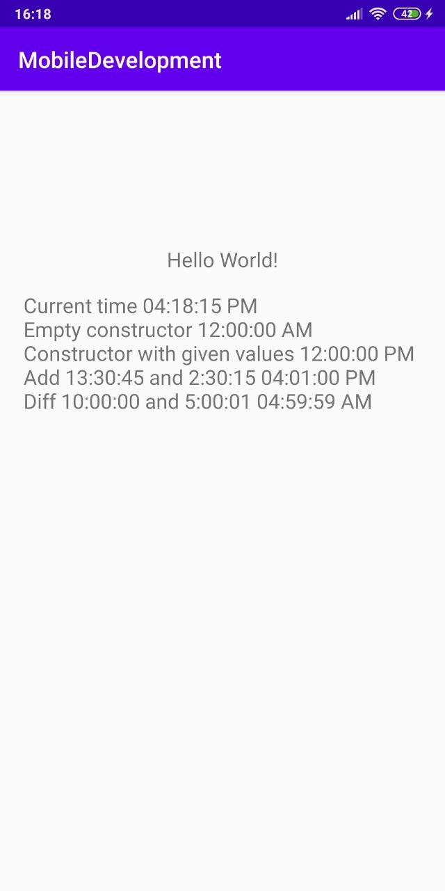

# MobileDevelopment

## Programming assignment 1 - Create an empty project

Unfortunately, I ran into the fact that my computer lags when working in a virtual machine with macOS and therefore I will study Android platform and Kotlin language.

## Programming assignment 2 - Create a TimeTL class to represent time in 12-hour clock

The screenshot shows the use of the TimeTL class.

